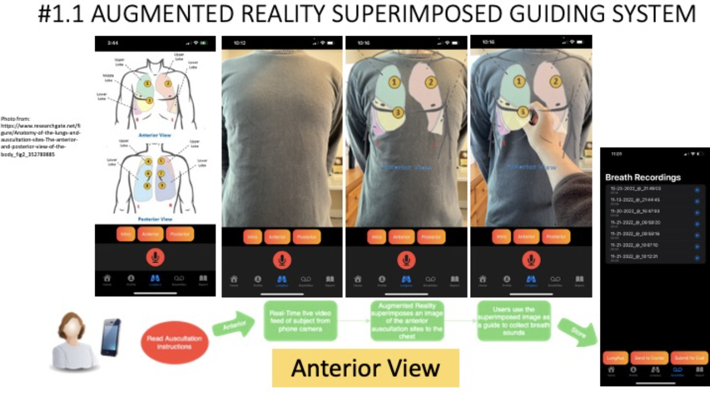
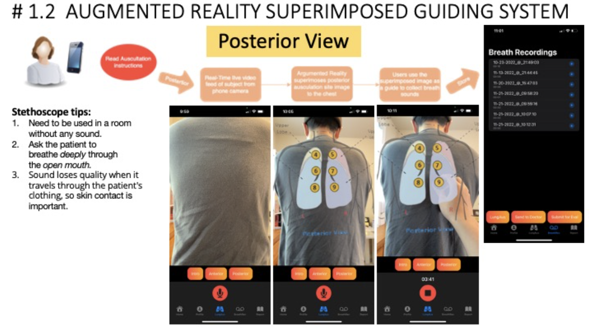

# 🌬️ Lung Auscultation Assessment System (LAAS)

[](https://developer.apple.com/swift/) 
[](https://pytorch.org/) 
[](https://developer.apple.com/ios/)

The **Lung Auscultation Assessment System (LAAS)** is a project I originally developed in 2022.  
It combines **augmented reality guidance** with **machine learning models** to help users perform lung sound auscultation more accurately and consistently.  

---

## 📖 Table of Contents
- [Features](#-features)
- [Tech Stack](#-tech-stack)
- [Screenshots](#-product-screenshots)
- [How to Run](#-how-to-run)
- [Next Steps](#-next-steps)
- [Credits](#-credits)

---

## 🚀 Features
- 📱 **AR Guidance**: Step-by-step overlay to position the stethoscope correctly.  
- 🤖 **Machine Learning Integration**: CNN-based model to analyze lung sounds.  
- 🏥 **Accessibility Focus**: Low-cost, user-friendly design for preventive healthcare.  

---

## 🛠 Tech Stack
- **Frontend**: Swift / SwiftUI (AR integration)  
- **ML Model**: PyTorch  
- **AR**: Apple ARKit overlays  
- **Backend/Deployment**: AWS (prototype for model serving)  

---

## 📸 Product Screenshots

<details>
<summary>Anterior View</summary>



</details>

<details>
<summary>Posterior View</summary>



</details>

---

## 🏃‍♀️ How to Run

### Prerequisites
- macOS with **Xcode 14+**  
- iOS device (iPhone/iPad) with **iOS 15+**  
- Python 3.9+  
- [PyTorch](https://pytorch.org/get-started/locally/) installed  
- AWS CLI (optional, for model serving)  

### Steps
```bash
# Clone the repo
git clone https://github.com/YOUR_USERNAME/LAAS.git
cd LAAS
```

#### iOS App
1. Navigate to `/ios-app/`
2. Open `LAAS.xcodeproj` or `LAAS.xcworkspace` in Xcode  
3. Run on a physical iOS device (ARKit not supported in simulator)  

#### ML Model
```bash
cd ml-model
pip install -r requirements.txt
python predict.py --input sample_sound.wav
```

#### (Optional) AWS Deployment
- Upload model to S3  
- Deploy with Flask/FastAPI  
- Update app config with API endpoint  

---

## 🔮 Next Steps
- Retrain ML model with larger, more diverse datasets  
- Enhance AR overlay precision  
- Deploy as a testable iOS app prototype  

---

## 🙌 Credits
✨ Created by **Sophie Lin**  
